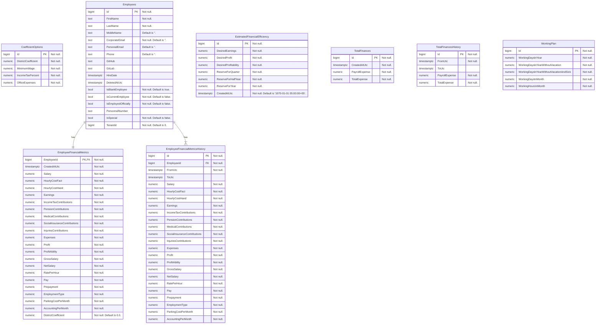

# inner-circle-employees-api

## Run in Visual Studio

First run this script to run a db and mocked external deps:
```bash
docker compose --profile MockForDevelopment up --build
```

## Migrations

### Adding a new migration  (Windows via Visual Studio)

Run the database using docker compose executing the following script (don't close the terminal unless you want to stop the containers)
```bash
docker compose --profile DbOnly up --build
```
>Note: `--build` gurantees that we run the latest code after re-applying the script

After making changes to the model and AppDbContext open Tools -> NuGet Package Manager -> Package Manager Console

If you want to use 'Update-Database' commands to apply migrations to the database please execute following command in Package Manager Console every time you open the solution.
```bash
$env:ASPNETCORE_ENVIRONMENT = 'MockForDevelopment';
```

Execute the following with your migration name
```bash
Add-Migration <YOUR_MIGRATION_NAME> -Project Application -Context AppDbContext
```

To apply migration run the following:
```bash
Update-Database -Project Application -Context AppDbContext
```

## Karate Tests

### Run Karate Tests Against Api Running in IDE (not Docker Compose)

Run Db and MockServer executing the following command (don't close the terminal unless you want to stop the containers)

```bash
docker compose --profile MockForDevelopment up --build
```

Then execute following command inside of the dev-container
```bash
API_ROOT_URL=http://host.docker.internal:5506 java -jar /karate.jar .
```

### Run Karate against Api, Db, and MockServer in Docker Compose

Run Api, Db, and MockServer executing the following command (don't close the terminal unless you want to stop the containers)

```bash
docker compose --profile MockForTests up --build
```

Then execute following command inside of the dev-container
```bash
API_ROOT_URL=http://localhost:6506 java -jar /karate.jar .
```

### Running Karate Tests, Api, Db, and MockServer in Docker Compose

Run the docker compose with MockForPullRequest profile executing the following command (don't close the terminal unless you want to stop the containers)

```bash
docker compose --profile MockForPullRequest up --build
```
>Note: this also includes Karate Tests run by default. However, if you want to run the test again from Dev Container execute:
```bash
API_ROOT_URL=http://localhost:6506 java -jar /karate.jar .
```

## Swagger

You can fetch OpenApi endpoints and types contract using this path `/swagger/openapi/v1.json`. Swagger UI is accessible here `/swagger/index.html`. 

However, UI doesn't support requests execution, this requires adding Auth dialog to pass a token. It is a bi

## Database scheme 


